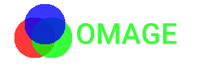
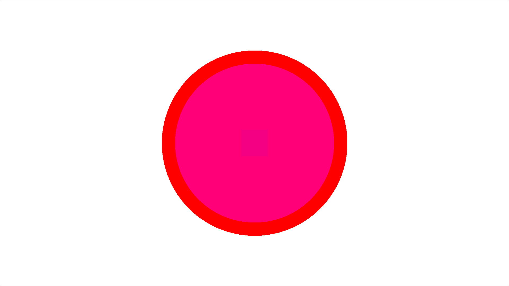

[](https://crates.io/crates/omage)
[](https://crates.io/crates/omage)
[](LICENSE-MIT)

`omage` is a Rust library for image processing. It provides functionality for handling images, drawing basic shapes, and configuring image properties.

## Features

- Image configuration with background colors.
- Drawing circles and rectangles on the image.
- Drawing fonts on the image
- Saving the resulting image to a file.

## Getting Started

To use `omage` in your Rust project, add the following to your `Cargo.toml` file:

```toml
[dependencies]
omage = "0.3.1"
```

Then, include it in your Rust code:

```rust
use omage::colors::*;
use omage::{Components, Config, Image};

const HEIGHT: u32 = 1080;
const WIDTH: u32 = 1920;

fn main() -> Result<(), Box<dyn std::error::Error>> {
    let config = Config::new(WIDTH, HEIGHT, WHITE, Some(BLACK), "output.png", None);

    let mut image = Image::new();

    let circle1 = Components::Circle(config.width / 2, config.height / 2, 300, RED);
    let circle2 = Components::Circle(config.width / 2, config.height / 2, 305, BLACK);

    image
        .config(config)
        .init()?
        .add_components(vec![&circle1, &circle2])
        .draw()?;
    Ok(())
}

```

### Output:


## Examples

### Drawing Circle

```rust
use omage::colors::*;
use omage::{Components, Config, Image};

const HEIGHT: u32 = 1080;
const WIDTH: u32 = 1920;

fn main() -> Result<(), Box<dyn std::error::Error>> {
    let config = Config::new(WIDTH, HEIGHT, WHITE, Some(BLACK), "output.png", None);

    let mut image = Image::new();

    let circle = Components::Circle(config.width / 2, config.height / 2, 300, RED);

    image.config(config).init()?.add_component(&circle).draw()?;
    Ok(())
}


```

### Output:


### Blending Colors

```rust
use omage::colors::*;
use omage::{Components, Config, Image, Rgba};

const HEIGHT: u32 = 1080;
const WIDTH: u32 = 1920;

fn main() -> Result<(), Box<dyn std::error::Error>> {
    let config = Config::new(WIDTH, HEIGHT, WHITE, Some(BLACK), "output.png", None);

    let mut image = Image::new();

    let circle1 = Components::Circle(config.width / 2, config.height / 2, 350, RED);
    let circle2 = Components::Circle(
        config.width / 2,
        config.height / 2,
        300,
        Rgba([255, 0, 255, 120]),
    );
    let rectangle = Components::Rectangle(
        100,
        100,
        config.width / 2 - 50,
        config.height / 2 - 50,
        Rgba([120, 0, 255, 19]),
    );

    image
        .config(config)
        .init()?
        .add_components(vec![&circle1, &circle2, &rectangle])
        .draw()?;
    Ok(())
}
```

### Output:



### Text

```rust
use omage::colors::*;
use omage::{Components, Config, Image, Rgba};

const HEIGHT: u32 = 100;
const WIDTH: u32 = 300;

fn main() -> Result<(), Box<dyn std::error::Error>> {
    let config = Config::new(
        WIDTH,
        HEIGHT,
        Rgba([255, 255, 255, 0]),
        Some(WHITE),
        "output.png",
        Some("./fonts/Roboto-Medium.ttf"),
    );

    let mut image = Image::new();

    let circle1 = Components::Circle(50, 55, 30, Rgba([255, 0, 0, 200]));
    let circle2 = Components::Circle(75, 55, 30, Rgba([0, 255, 0, 200]));
    let circle3 = Components::Circle(65, 35, 30, Rgba([0, 0, 255, 200]));

    let text = "ROMAGE";
    let text = Components::Text(
        config.width / 2 - 40,
        config.height / 2 - 25,
        50,
        text,
        Rgba([0, 255, 0, 200]),
    );

    image
        .config(config)
        .init()?
        .add_components(vec![&text, &circle1, &circle2, &circle3])
        .draw()?;
    Ok(())
}

```

### Output:


## License

This project is licensed under the MIT License - see the [LICENSE](LICENSE) file for details.
