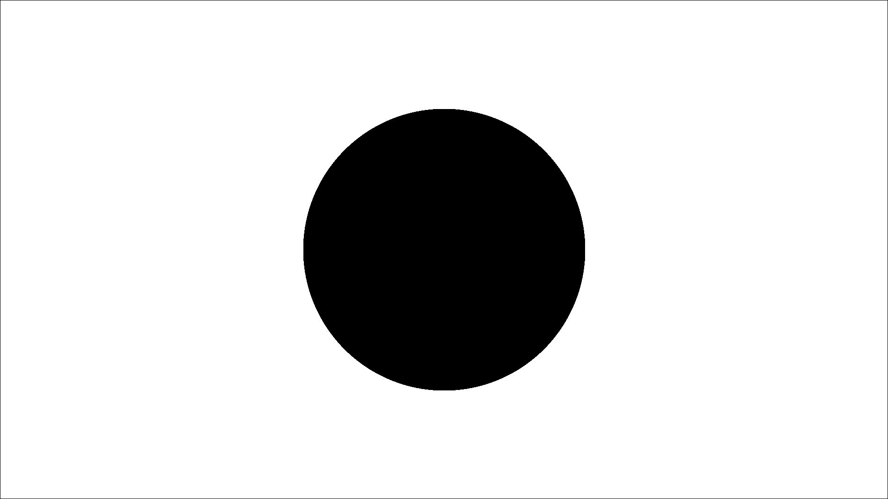
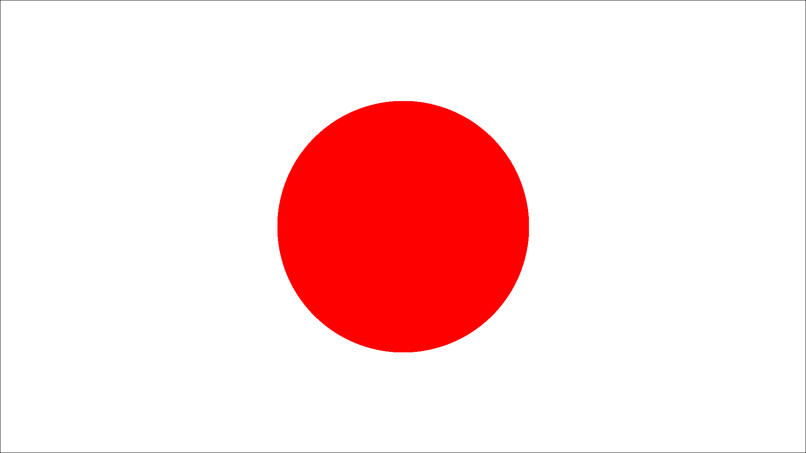

# Omage

`omage` is a Rust library for image processing. It provides functionality for handling images, drawing basic shapes, and configuring image properties.

## Features

- Image configuration with background and foreground colors.
- Drawing circles and rectangles on the image.
- Saving the resulting image to a file.

## Getting Started

To use `omage` in your Rust project, add the following to your `Cargo.toml` file:

```toml
[dependencies]
omage = "0.1"
```

Then, include it in your Rust code:

```rust
use omage::colors::*;
use omage::{Components, Config, Image};

const HEIGHT: u32 = 1080;
const WIDTH: u32 = 1920;

fn main() -> Result<(), Box<dyn std::error::Error>> {
    let config = Config::new(WIDTH, HEIGHT, WHITE, Some(BLACK), "output.png");

    let mut image = Image::new();

    let circle1 = Components::Circle(config.width / 2, config.height / 2, 300, RED);
    let circle2 = Components::Circle(config.width / 2, config.height / 2, 305, BLACK);

    image
        .config(config)
        .init()?
        .add_components(vec![circle1, circle2])
        .draw()?;
    Ok(())
}

```

### Output:



## Exampleshttps://github.com/HakanVardarr/omage

### Drawing Circle

```rust
use omage::colors::*;
use omage::{Components, Config, Image};

const HEIGHT: u32 = 1080;
const WIDTH: u32 = 1920;

fn main() -> Result<(), Box<dyn std::error::Error>> {
    let config = Config::new(WIDTH, HEIGHT, WHITE, Some(BLACK), "output.png");

    let mut image = Image::new();

    let circle = Components::Circle(config.width / 2, config.height / 2, 300, RED);

    image
        .config(config)
        .init()?
        .add_component(circle)
        .draw()?;
    Ok(())
}

```

### Output:



## License

This project is licensed under the MIT License - see the [LICENSE](LICENSE) file for details.
